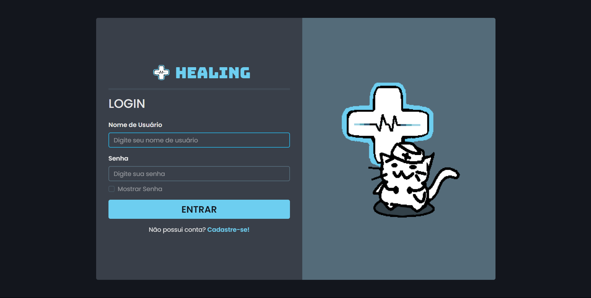
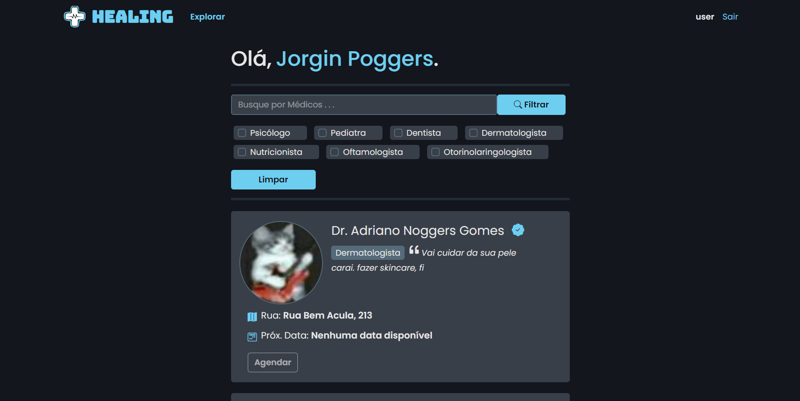
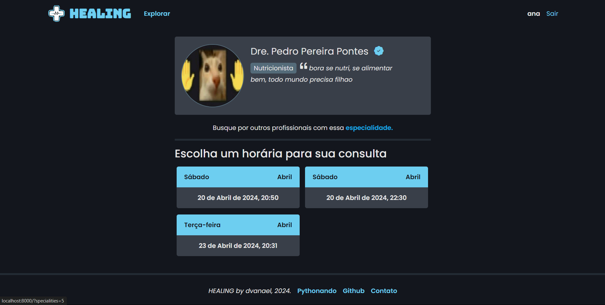
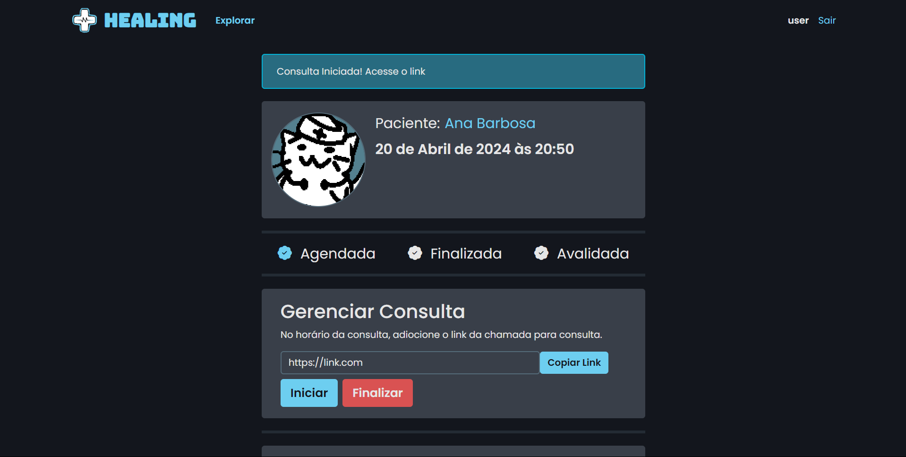
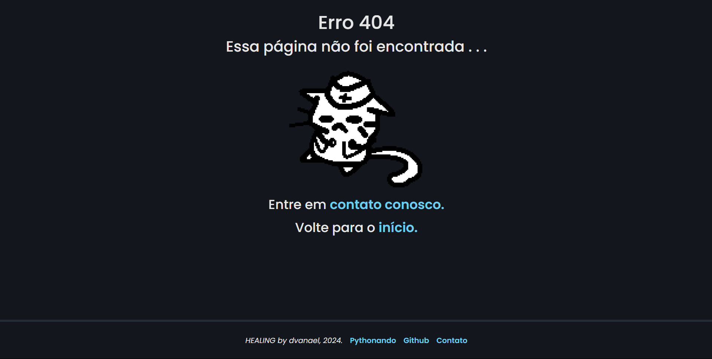

# 

## SOBRE

Healing é um sistema de telemedicina desenvolvido com base nas aulas da _Pystack Week 10_, sendo uma aplicação web criada para estudos e aprimorar minhas habilidades com _Django Framework_. 

O sistema Healing possui as seguintes funciolalidades:

  - Login e Cadastro de usuário

  - Cadastro de Médicos

  - Busca de Médicos

  - Cadastro de Horários para Consultas

  - Agendamento e Gerenciamento de Consultas  

  - Responsividade

> **!** Todas as artes e telas são de elaboração própria.

## TECNOLOGIAS UTILIZADAS


 
 
 
 


## INSTALAÇÃO
### Configurando o ambiente
 - Clone o [repositório](https://github.com/dvanael/healing/)

```bash
git clone https://github.com/dvanael/healing.git
```

- Crie um ambiente virtual

```bash
python -m venv .venv
```

- Ative o ambiente virtual 
  
_windows_
```bash
source .venv/Scripts/activate
```
_linux, macOs_
```bash
source .venv/bin/activate
```

---

### Configurando sua máquina

- Instale as dependências

```bash
pip install -r requiriments.txt
```

- Crie as variáveis de ambiente

```bash
python contrib/env_gen.py
```
> Se necessário, mude as configurações do  arquivo ``.env``

- Faça as migrações necessárias

```bash
python manage.py makemigrations
python manage.py migrate
```

---

### Rodando o servidor

- Crie um super usuário

```bash
python manage.py createsuperuser
```

- Rode o sevirdor

```bash
python manage.py runserver
```

- Acesse a aplicação localmente

  - **[localhost:8000/](http://localhost:8000/)**

---

## APRESENTAÇÃO
Nesta seção, algumas capturas de tela do sistema funcionando.

### Capturas de Tela

**Login**


---

**Página Inicial**


---

**Agendar Consulta**


---

**Consulta Agendada**


---

**Página de Erro 404**


---